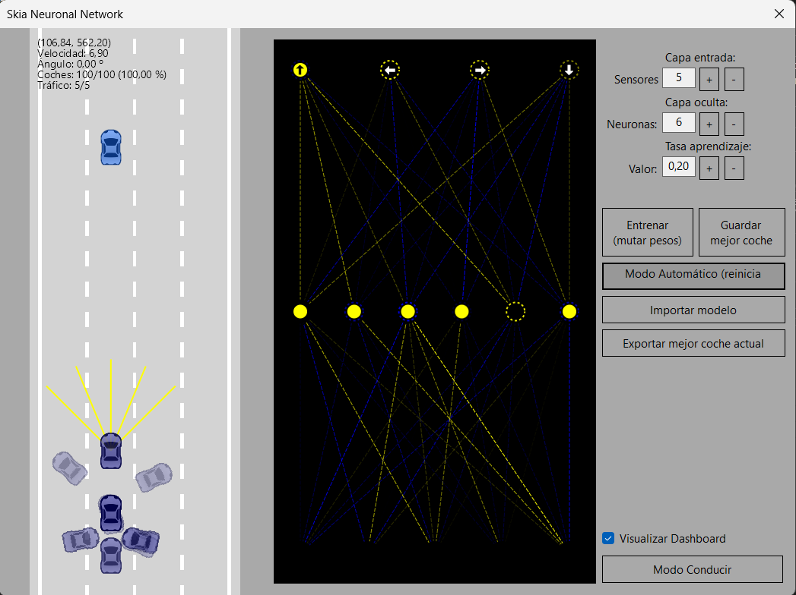
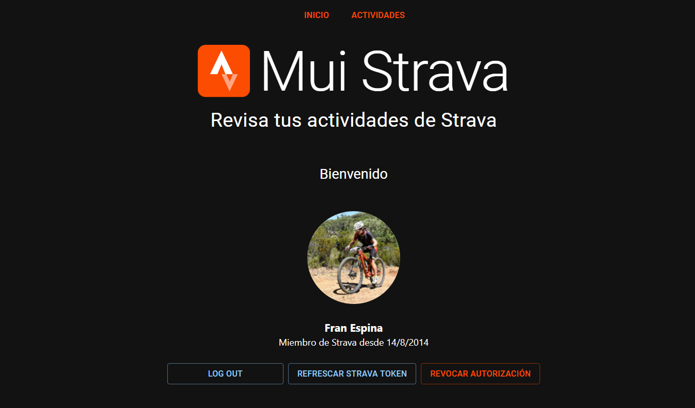
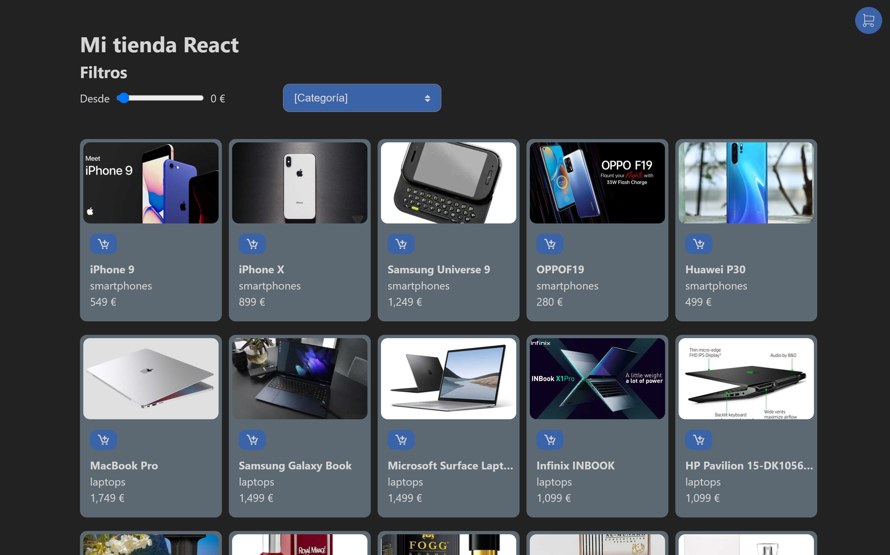
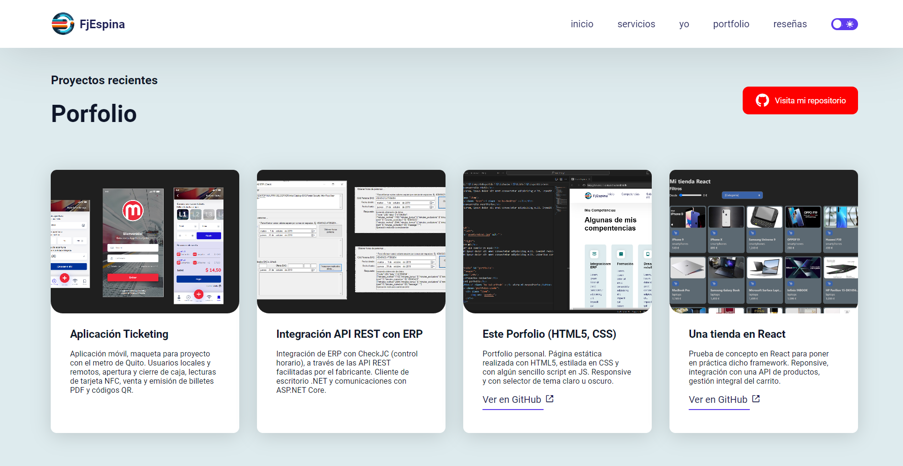

#  Hola, soy Fran Espina👋

### Motivado, dinámico y proactivo
Licenciado en Matemáticas 🔢 y atrapado por la tecnología. Profesionalmente he compaginado la docencia y la programación. A los 12 años hice mi primer pong en basic en un 💾 Amstrad CPC 464.

Trabajo a cuenta ajena y también he sido autónomo. Depende del proyecto y del tipo de colaboración. He sido soporte, desarrollador, he dirigido proyectos y gestionado equipos. Sin duda, prefiero programar.

En mi tiempo libre me pierdo con mi bicicleta MTB y siempre que puedo me gusta viajar y hacer turismo de playa o montaña. Aunque durante años deambulé por España ahora me encuentro de vuelta en mi tierra, Cádiz.

<!-- 
 -->

## Encuéntrame en:
Te dejo donde poder encontrarme, aunque si lo prefieres me puedes 💬 por email en la direccion 📧 francisco.espina.aragon@gmail.com 

Si lo prefieres puedes acceder a un resumen de mi [curriculum en PDF](https://www.canva.com/design/DAFwTGjpQes/quZoDoXJPSQr9o29TGHhIQ/view?utm_content=DAFwTGjpQes&utm_campaign=designshare&utm_medium=link&utm_source=publishsharelink) o a un [listado detallado de proyectos](https://fjespina.netlify.app/assets/Proyectos%20Freelance%20Fran%20Espina.pdf) donde listo proyecto, competencias y tecnologías usadas.

### Listado de proyectos públicos
La mayoría de mis proyectos son privados porque así lo desean mis clientes. En cualquier caso te dejo una lista de repositorios públicos en los tengo algunos proyectos interensantes y que normalmente uso para ponerme al día de nuevas tecnologías.

#### .NET SKiasharp + Redes neuronales
Pruebas de uso de red neuronal para la [conducción autónoma](https://github.com/FranEspina/SkiaCarForms) de un vehículo. Dibujado con el canvas de SkiaSharp usando c# .NET como lenguaje de programación. 

Permite jugar controlando un coche 2D, simular tráfico, entrenar una perceptrón multicapa para que aprenda a esquivar vehículos. En el lateral se puede ver la neurona y la activación de la entradas y salidas de las diferentes capas.

#### MUI Strava
Cliente WEB para interacciones con los datos de Strava:
- [Backend](https://github.com/FranEspina/api-strava) - NodeJs, Javascript, express, MongoDb.
- [Frontend](https://github.com/FranEspina/strava-client) - React + TypeScript

#### React
Diferentes [proyectos](https://github.com/FranEspina/react-projects)  y pruebas con React y sus principales hooks.

#### Porfolio personal
[Porfolio](https://github.com/FranEspina/static-portfolio) HTML5 con CSS

